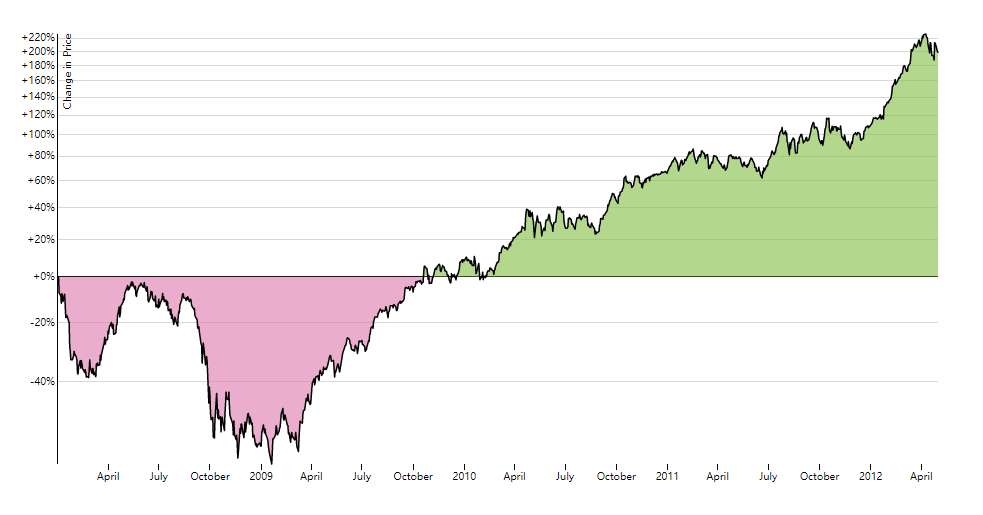
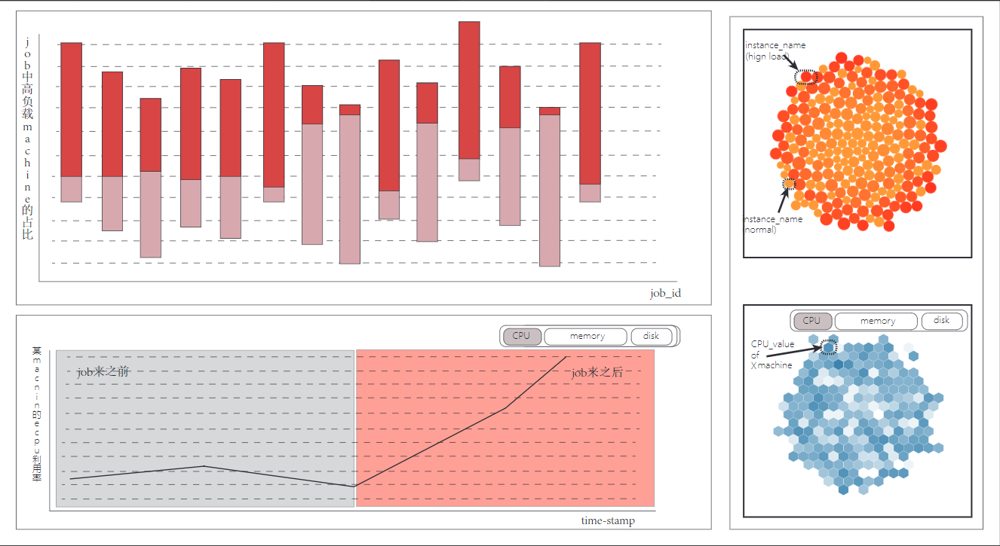

# #9.11 更新UI
***

今天和蒲老师大概聊了一下，收获还蛮多的
根据刚才的启发，更新了一下UI，
新增了一个非常有效果的框图————时序对比图

类似上图的

这样就可以清楚的看到某一个machine在一个可疑job进来前是什么状态，然后进来之后各项参数都发生了什么变化。

这在我们论证某一个job是一个可疑job的时候比较有说服力。

下图是我新画的UI，各个组件的功能都没有太大的变化，变得只是设计和新增的一个对比时序图。

类似上图的

高清图建议老师看pdf格式的

左上的视图是原来碰撞图的一个更新，用堆积的柱状图来体现高负载machine和normal—machine的占比问题。这样子的好处就是：
* 把饼状图不能表达的基数问题解决了
* 可以在组件内尽可能多的展示job群体的样本。一个柱形图代表一个job

大概的工作流程是这样的：
* 主视图依然是左上角的视图，在刷新之后看到红色占比很高的就**很可能**是该job引起的各个machine的高负载
* 点击想要观察的job柱状图，右侧上方是该job下所有的instance的集合。颜色代表处理该instance的machine负载的高低。是对刚才的柱状图的一个量化解释
* 右下的视图和右上的视图同时刷新，表示的是某一个可以job下的machine集群的情况，可以在cpu、memory和disk三种模式间切换。排布模拟的是真实服务器集群的样子。如图中颜色深的六边形代表该machine的cpu利用率非常高。
* 左下的视图是根据蒲老师的启发这次更新的视图。灰色区域代表某台machine在可疑job的instance来之前的cpu利用率的高低，红色区域是job的instance来之后的cpu高低。我们当然希望看到红色区域内的指标较之前有较大的抬升，这样比较有说服力。